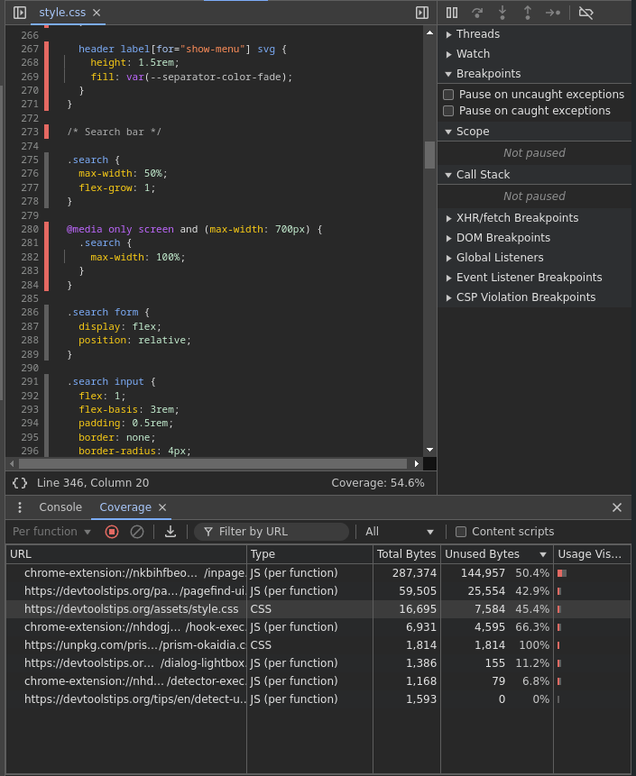

# Código CSS y JS huérfano

Para optimizar la velocidad de carga y la experiencia de usuario en nuestra página web, es fundamental cargar únicamente el CSS y JavaScript necesarios en cada sección.

Para identificar el código innecesario que se carga en la web, podemos utilizar la herramienta **Coverage** de las DevTools.

Para acceder a esta herramienta, abre las DevTools y presiona <kbd>Ctrl</kbd> + <kbd>Shift</kbd> + <kbd>P</kbd>, escribe "Coverage" y pulsa <kbd>Enter</kbd>.

Dentro de Coverage, haz clic en <strong>Start</strong>. La página se recargará automáticamente y, al finalizar, verás un informe con una lista de archivos CSS y JS, junto con el porcentaje de bytes no utilizados.

Si haces clic en cualquiera de los archivos listados, se abrirá el archivo correspondiente. A la izquierda, junto a los números de línea, verás unas líneas verticales: las azules indican el código que está en uso, mientras que las rojas muestran el código que no se está utilizando.

