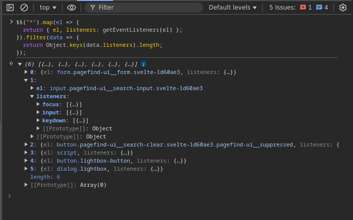

# Listar todos los event listeners

Cuando trabajamos con código desconocido o proyectos grandes, puede resultar difícil saber por dónde comenzar y qué eventos se están escuchando en los distintos elementos del DOM.

Puedes utilizar el siguiente fragmento de código directamente en la consola de las DevTools de Chrome para obtener un listado de todos los event listeners activos en la página. El resultado será un array de objetos, donde cada objeto contiene el elemento y sus listeners asociados. Además, se filtran los elementos que no tienen ningún listener conectado.

### Código

```js
$$('*').map(el => {
  return { el, listeners: getEventListeners(el) }
}).filter(data => {
  return Object.keys(data.listeners).length
})
```

> 💡 **Consejo:** Este método solo funciona en la consola de Chrome DevTools, ya que utiliza funciones específicas de esta herramienta (`$$` y `getEventListeners`).

